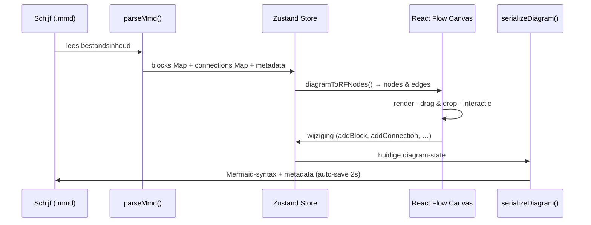

# MMD Flowchart Editor

Een browser-gebaseerde WYSIWYG editor voor het maken en bewerken van Mermaid-flowcharts (`.mmd`-bestanden). Diagrammen worden opgeslagen als leesbare tekstbestanden, direct in een lokale map op schijf.

> **Browser:** Chrome / Chromium vereist — de File System Access API wordt niet ondersteund in Firefox of Safari.

---

## Installatie & starten

```bash
npm install
npm run dev
```

Beschikbaar op `http://localhost:5173`.

## Productie build

```bash
npm run build        # output naar /dist
npm run preview      # lokale preview van de productie-build
```

## Docker

```bash
# Build
docker build -t mmd-flowchart .

# Run
docker run -p 3100:80 mmd-flowchart
```

Of via Docker Compose:

```bash
docker compose up -d
```

Open `http://localhost:3100` in Chrome.

---

## Hoe de app werkt

```
┌─────────────────────────────────────────────────────────────────┐
│  Toolbar  (opslaan · nieuw · exporteren · zoom · undo/redo · thema) │
├──────────────┬──────────────────────────────┬───────────────────┤
│              │                              │                   │
│  Sidebar     │   Canvas (React Flow)        │  Right panel      │
│              │                              │                   │
│  Mappenpad   │   Nodes (blokken)            │  Blok-palette     │
│  ├ map/      │   Edges (verbindingen)       │  Blok-properties  │
│  │ ├ a.mmd   │   Grid 16px                  │  Verbinding-props │
│  │ └ b.mmd   │   Quick-add stems (+)        │  Commentaar       │
│  └ c.mmd     │   QuickAdd-menu (radiaal)    │                   │
│              │   YN-picker (beslissing)     │                   │
└──────────────┴──────────────────────────────┴───────────────────┘
```

**Dataflow:**



---

## Tech stack

| Tool | Versie | Rol |
|---|---|---|
| React | 18 | UI framework |
| TypeScript | ~5.7 | Statische typering |
| Vite | ^6 | Build tool & dev server |
| @xyflow/react | ^12 | Canvas, drag & drop, selectie |
| Zustand | ^5 | State management |
| Tailwind CSS | ^3 | Utility-first CSS (basis) |
| Lucide React | ^0.511 | Iconen |
| Mermaid | ^10.9.5 | Read-only preview voor niet-ondersteunde diagrammen |
| html-to-image | ^1.11 | PNG/SVG export |

---

## Documentatie

- [FO.md](FO.md) — gedetailleerde functionele beschrijving van alle features, bloktypen, verbindingsregels en interacties.
- [USERFLOWS.md](USERFLOWS.md) — stapsgewijze user flows als Mermaid-diagrammen (nieuw diagram, nodes toevoegen, verwijderen, opslaan, exporteren, etc.).
