# User Flows — MMD Flowchart Editor

Alle interacties beschreven als stapsgewijze flows in Mermaid-syntax.

---

## 1. Nieuw diagram maken

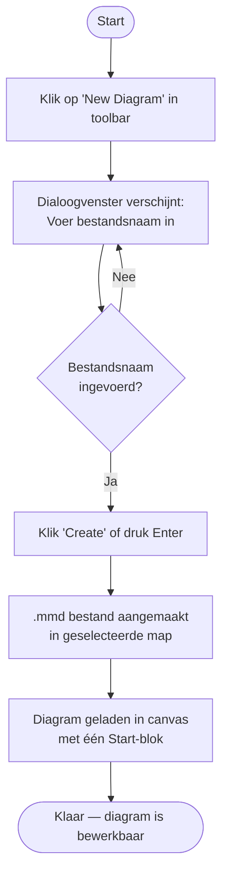

---

## 2. Blok toevoegen of verbinden via de stem

De stem verschijnt **alleen bij nieuw op het canvas geplaatste blokken** als visuele hint om direct door te bouwen. Aan het uiteinde van de stemlijn zit het **verbindingspunt** (source handle) én de **+**-knop.

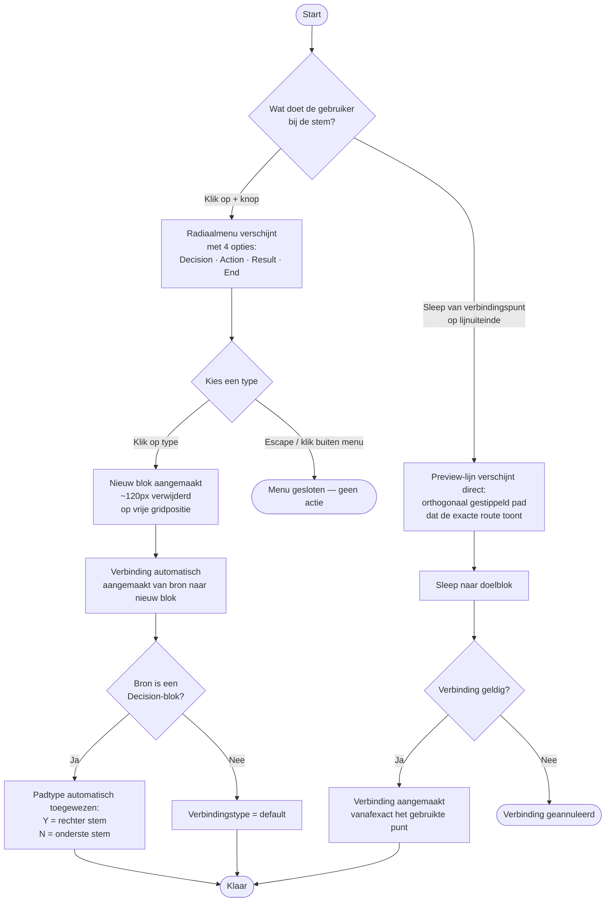

**Positielogica (quick-add):**
- Het nieuwe blok wordt gecentreerd onder het huidige blok geplaatst.
- Als die positie bezet is, wordt een vrije positie naast of verder weg geprobeerd (tot 8 pogingen, telkens 120px opzij).

**Verbindingspunt op de lijnpunt:**
- Het source handle zit op het uiteinde van de stemlijn, niet op de blok-rand.
- De stem verdwijnt zodra het bijbehorende pad aangemaakt is. Als een bestaande verbinding later verwijderd wordt, keert de stem **niet** terug.

---

## 3. Blok verplaatsen (slepen)

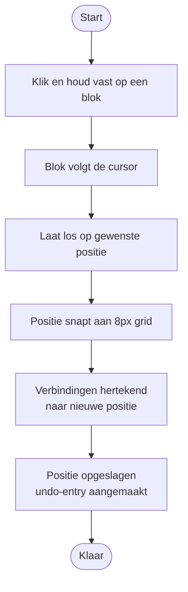

---

## 4. Blok verwijderen

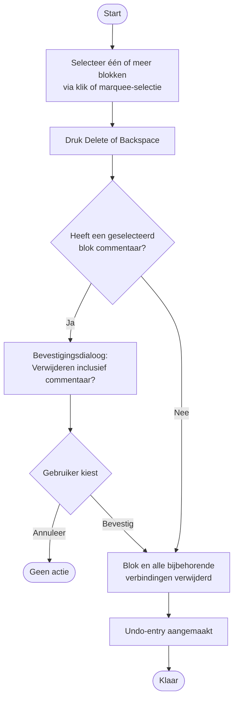

---

## 5. Verbinding handmatig aanmaken

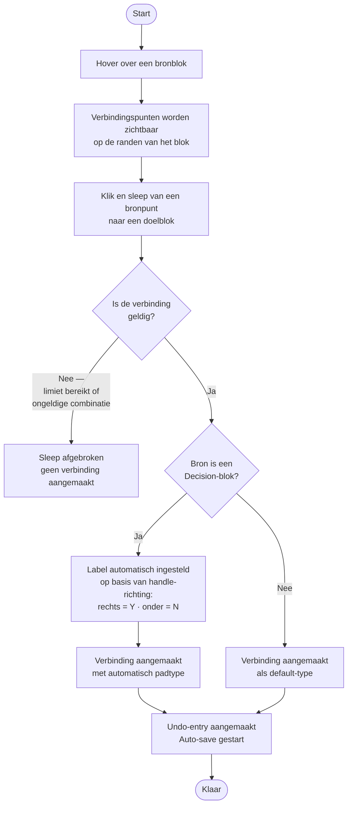

---

## 6. Diagram opslaan

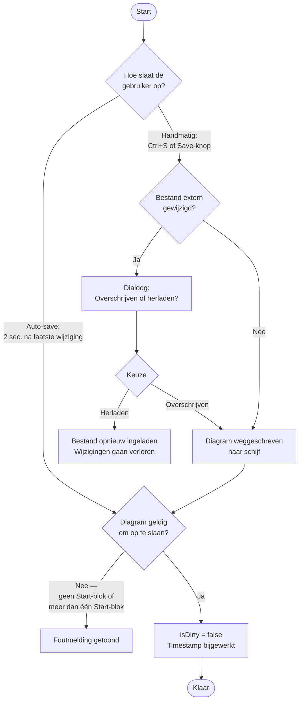

---

## 7. Map openen en bestand selecteren

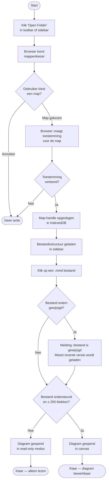

---

## 8. Verbinding verwijderen

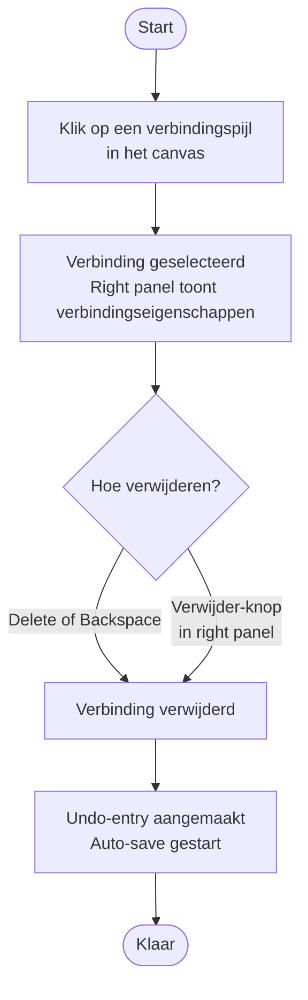

---

## 9. Commentaar toevoegen aan een blok

---

## 10. Undo / Redo

---

## 11. Blok-label bewerken (inline)

Alleen **Action**, **Decision** en **Result** hebben een bewerkbaar label. De labels van **Start** ("Start") en **End** ("End") zijn vast.

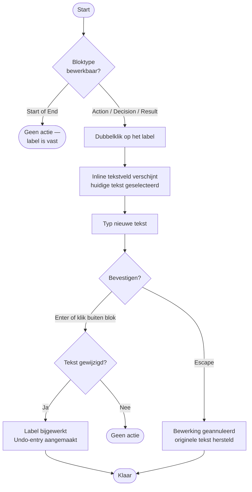

---

## 12. Thema wisselen

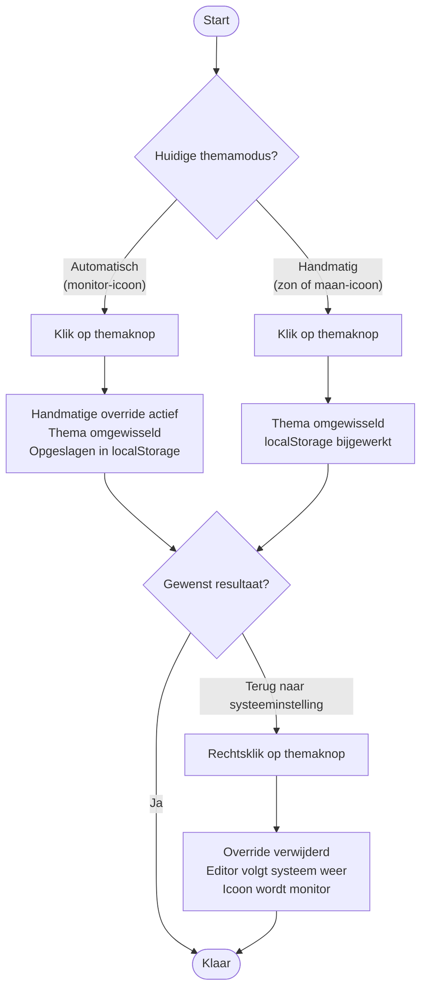

---

## 13. Exporteren als PNG of SVG

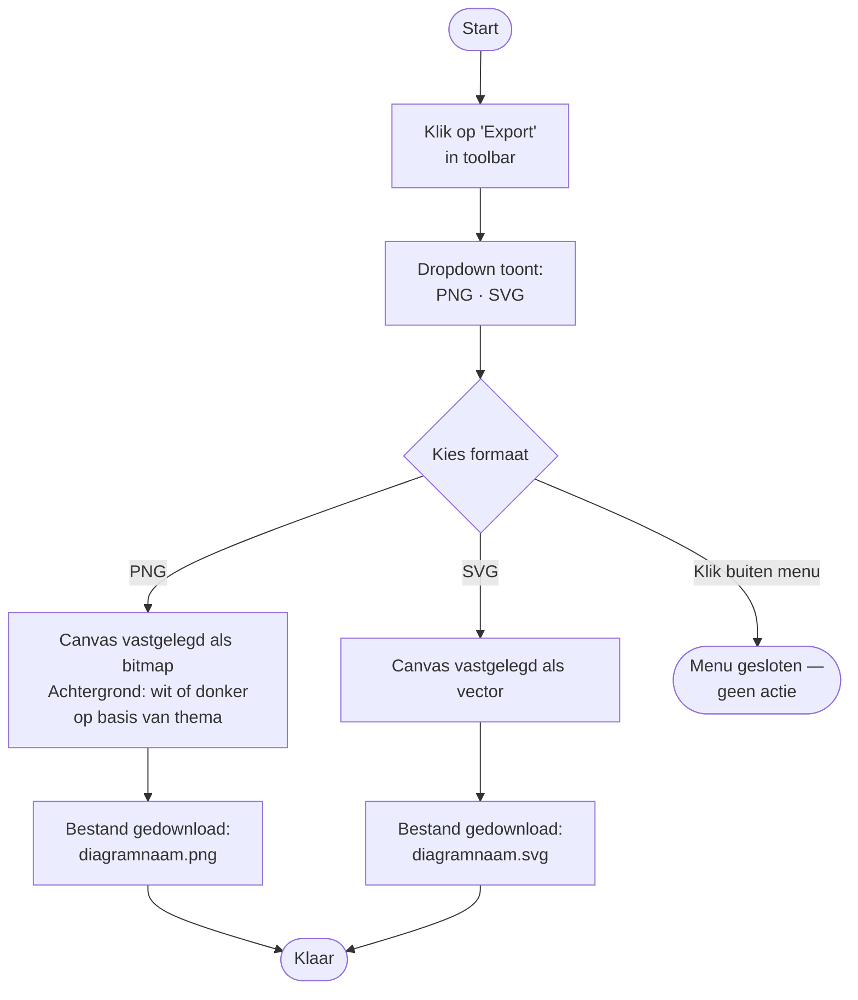

---

## 14. Bestandscontextmenu (rechtermuisknop in sidebar)

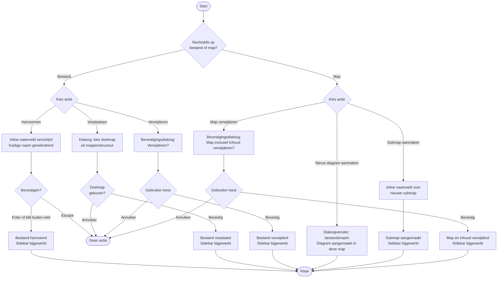
