# User Flows — MMD Flowchart Editor

Alle interacties beschreven als stapsgewijze flows in Mermaid-syntax.

---

## 1. Nieuw diagram maken

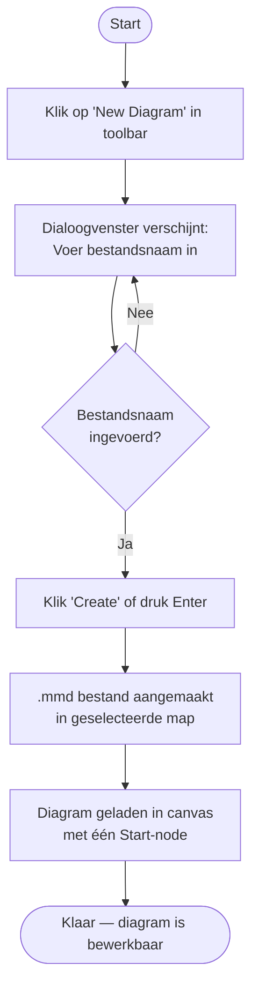

---

## 2. Node toevoegen of verbinden via de stem

Elk blok dat nog verbindingen kan aanmaken, toont een **stem**: een lijn met pijlpunt in de kleur van verbindingslijnen. Aan het uiteinde van de lijn zit het **verbindingspunt** (source handle) én de **+**-knop.

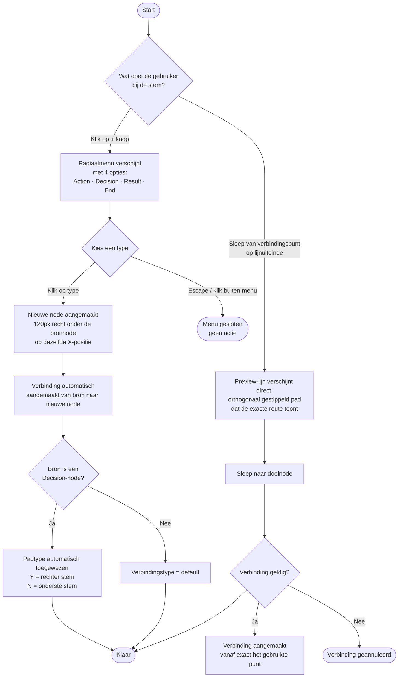

**Positielogica (quick-add):**
- De nieuwe node krijgt dezelfde X-positie als de bronnode.
- De Y-positie is: `bronnode.y + 120px` (altijd recht naar beneden).
- Als die positie bezet is, wordt 120px opzij geprobeerd (tot 8 pogingen).

**Verbindingspunt op de lijnpunt:**
- Het source handle zit op het uiteinde van de stemlijn, niet op de node-rand.
- Hierdoor is de stem visueel én functioneel de vervanger van het verbindingspunt op die zijde.

---

## 3. Node verplaatsen (slepen)

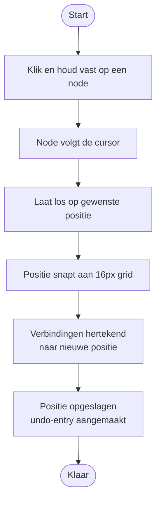

---

## 4. Node verwijderen

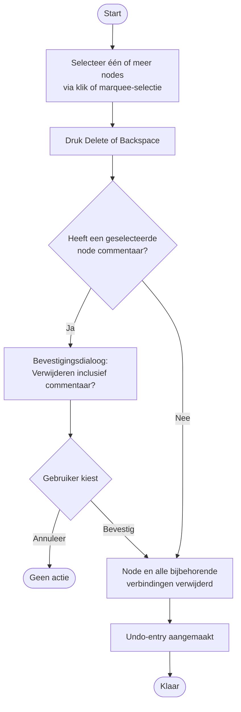

---

## 5. Verbinding handmatig aanmaken

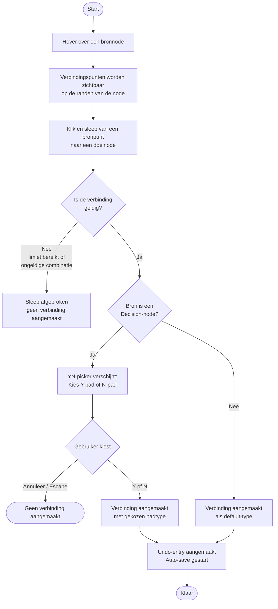

---

## 6. Diagram opslaan

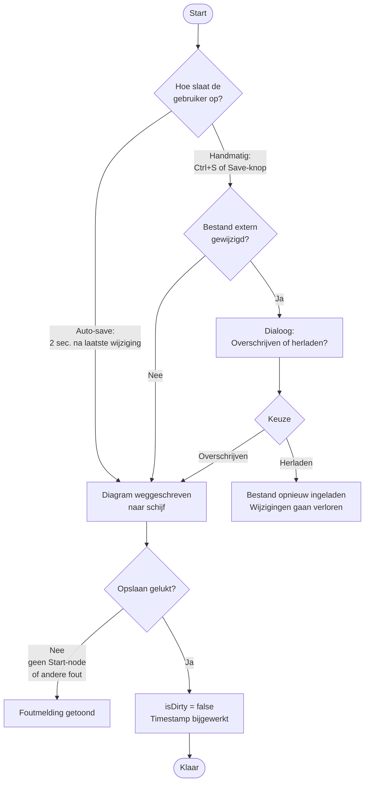

---

## 7. Map openen en bestand selecteren

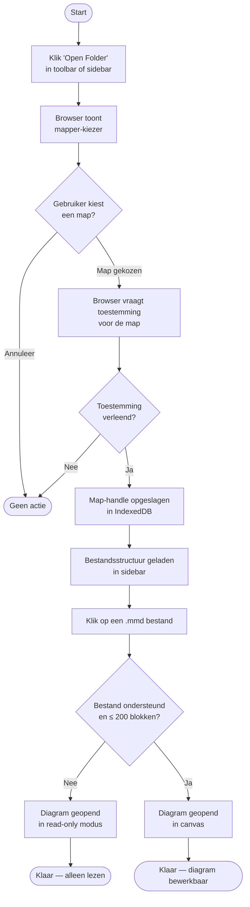

---

## 8. Verbinding verwijderen

---

## 9. Commentaar toevoegen aan een node

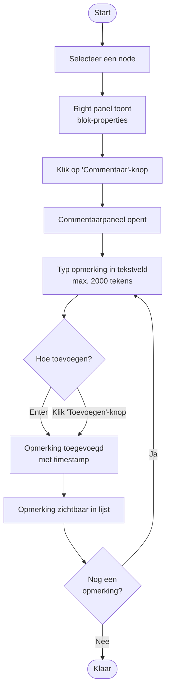

---

## 10. Undo / Redo

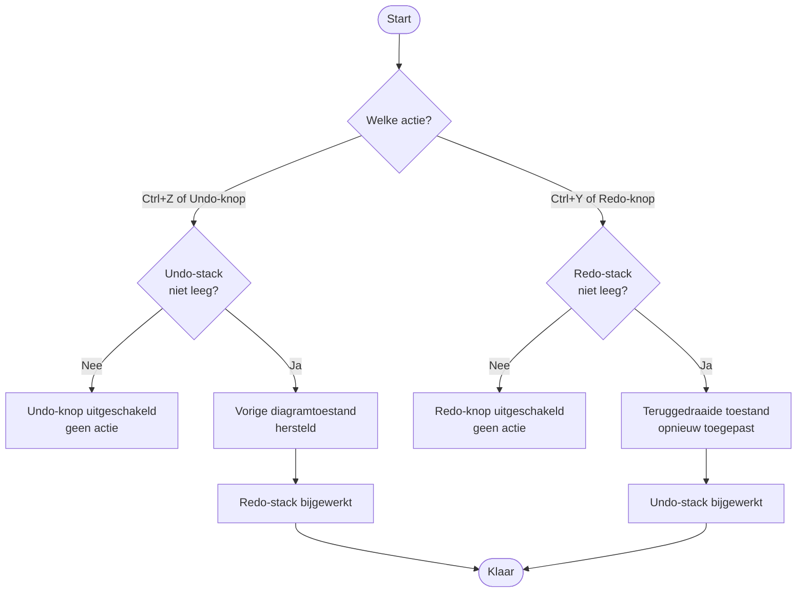

---

## 11. Node label bewerken (inline)

Alleen **Action**, **Decision** en **Result** hebben een bewerkbaar label. De labels van **Start** ("Start") en **End** ("End") zijn vast.

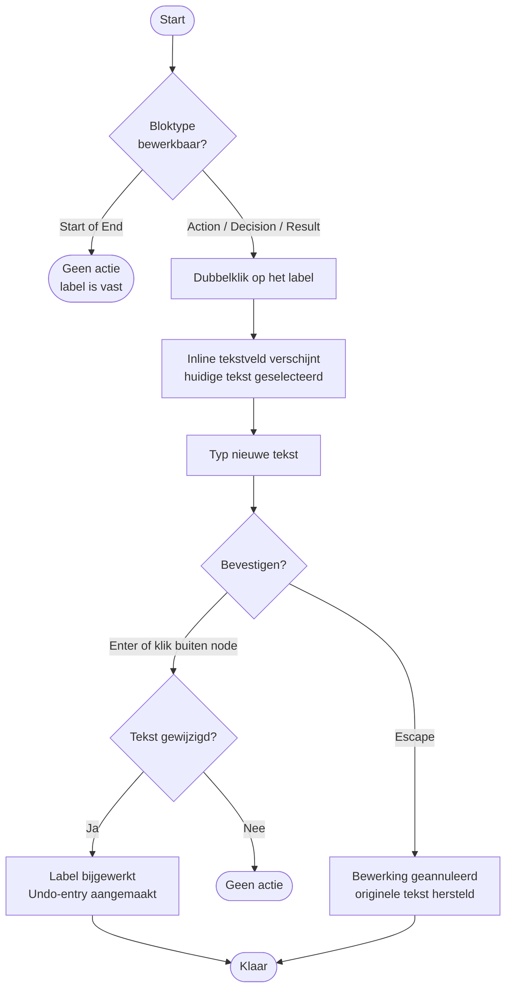

---

## 12. Thema wisselen

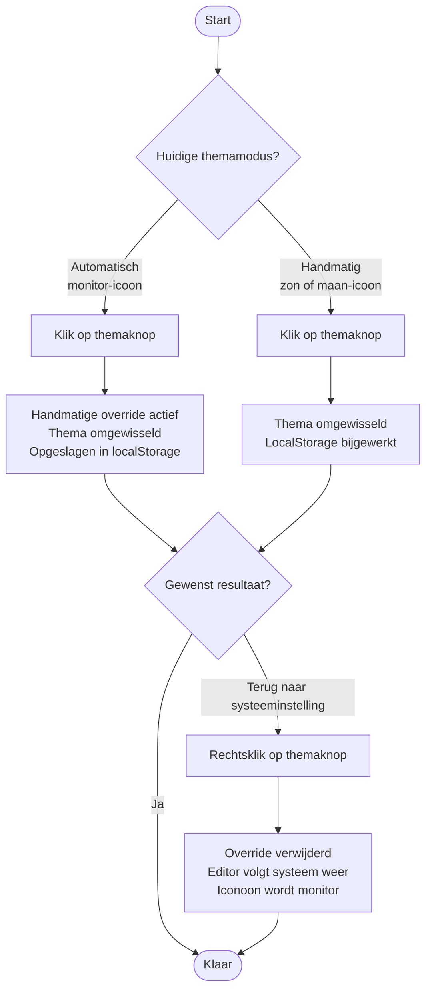

---

## 13. Exporteren als PNG of SVG

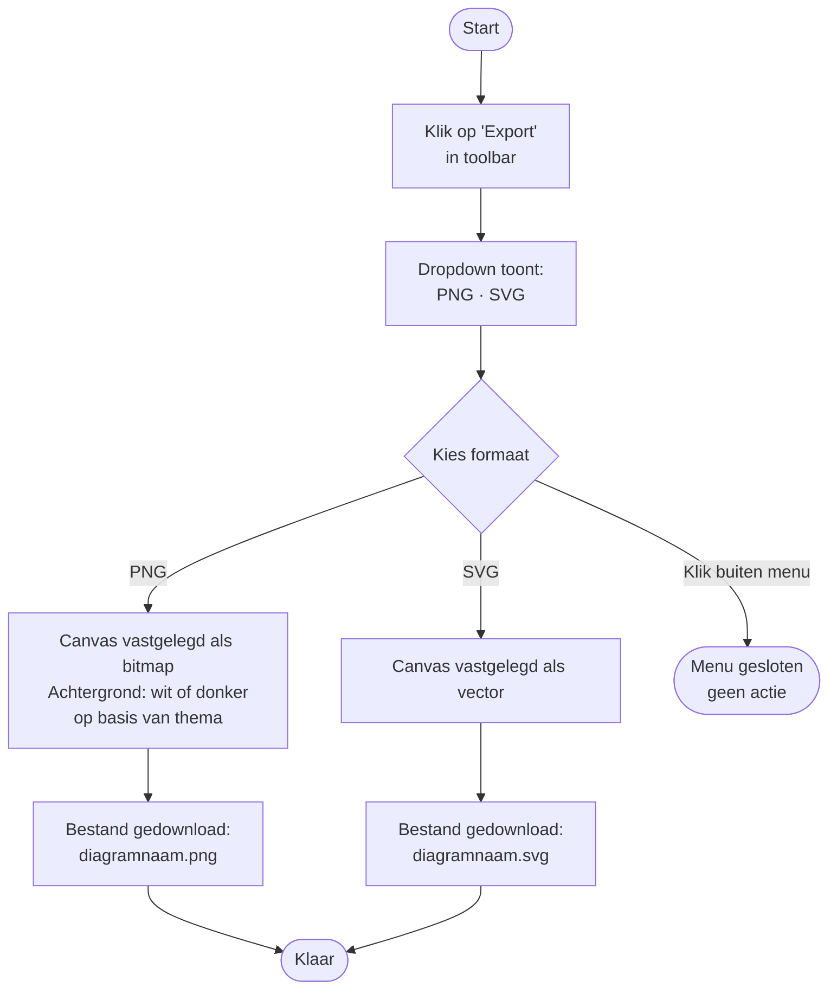
