# User Flows — MMD Flowchart Editor

Alle interacties beschreven als stapsgewijze flows in Mermaid-syntax.

---

## 1. Nieuw diagram maken

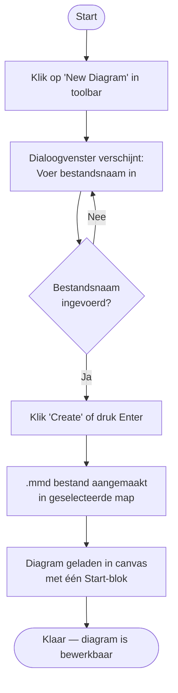

---

## 2. Blok toevoegen of verbinden via de stem

De stem verschijnt **alleen bij nieuw op het canvas geplaatste blokken** als visuele hint om direct door te bouwen. Aan het uiteinde van de stemlijn zit het **verbindingspunt** (source handle) én de **+**-knop.

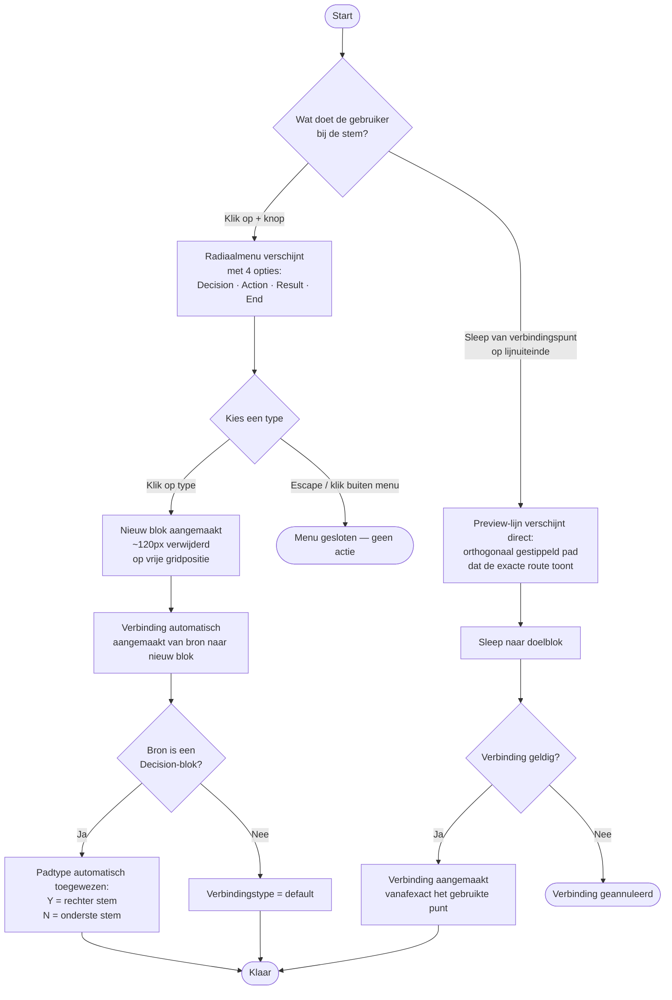

**Positielogica (quick-add):**
- Het nieuwe blok wordt gecentreerd onder het huidige blok geplaatst.
- Als die positie bezet is, wordt een vrije positie naast of verder weg geprobeerd (tot 8 pogingen, telkens 120px opzij).

**Verbindingspunt op de lijnpunt:**
- Het source handle zit op het uiteinde van de stemlijn, niet op de blok-rand.
- De stem verdwijnt zodra het bijbehorende pad aangemaakt is. Als een bestaande verbinding later verwijderd wordt, keert de stem **niet** terug.

---

## 3. Blok verplaatsen (slepen)

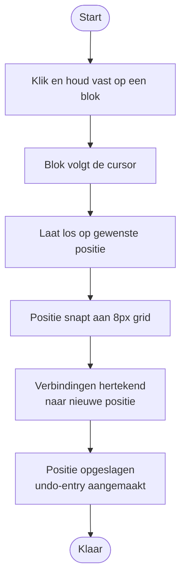

---

## 3b. Blokken dupliceren (Ctrl/Cmd+D)

Een snelle manier om bestaande blokken — al dan niet in groep — direct te kopiëren binnen het canvas. Handig voor herhalende patronen (bv. een set van Action → Decision → Result die je nog een paar keer wilt). Verbindingen die volledig binnen de selectie liggen worden mee-gekopieerd; verbindingen naar buiten de selectie blijven bij het origineel.

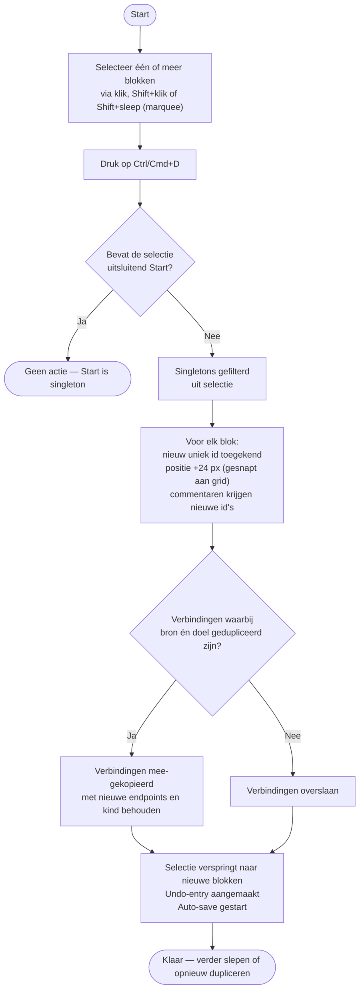

---

## 3c. Kopiëren en plakken (Ctrl/Cmd+C / Ctrl/Cmd+V)

Naast direct dupliceren is er een echte klembord-flow: kopieer eerst, plak vervolgens één of meerdere keren. Het klembord houdt een snapshot vast die los staat van het origineel — verwijder of bewerk het origineel daarna en je plak nog steeds wat je gekopieerd had. Het klembord leeft alleen in de huidige sessie van het geopende bestand; bij bestand wisselen of refreshen is het leeg.

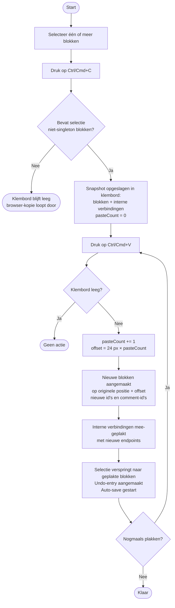

---

## 4. Blok verwijderen

Bij een meervoudige selectie (blokken + verbindingen) toont het right panel uitsluitend een verwijder-knop; een enkele druk op Delete of op die knop verwijdert het hele pakket.

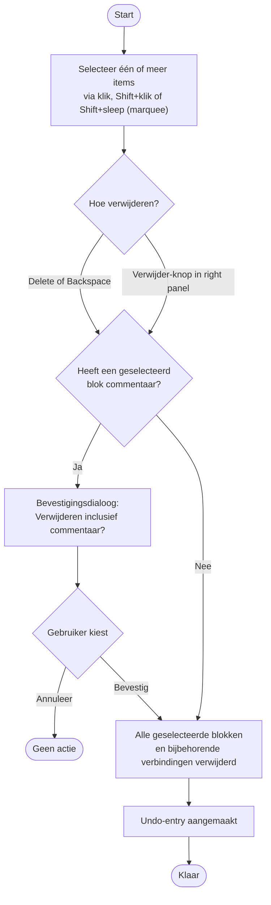

---

## 4b. Door de flow navigeren via uitgaande paden

Het right panel toont voor elk geselecteerd blok (behalve End) een lijst van uitgaande paden. Klikken op een pad selecteert het doelblok — handig om een lange flow stap voor stap te volgen.

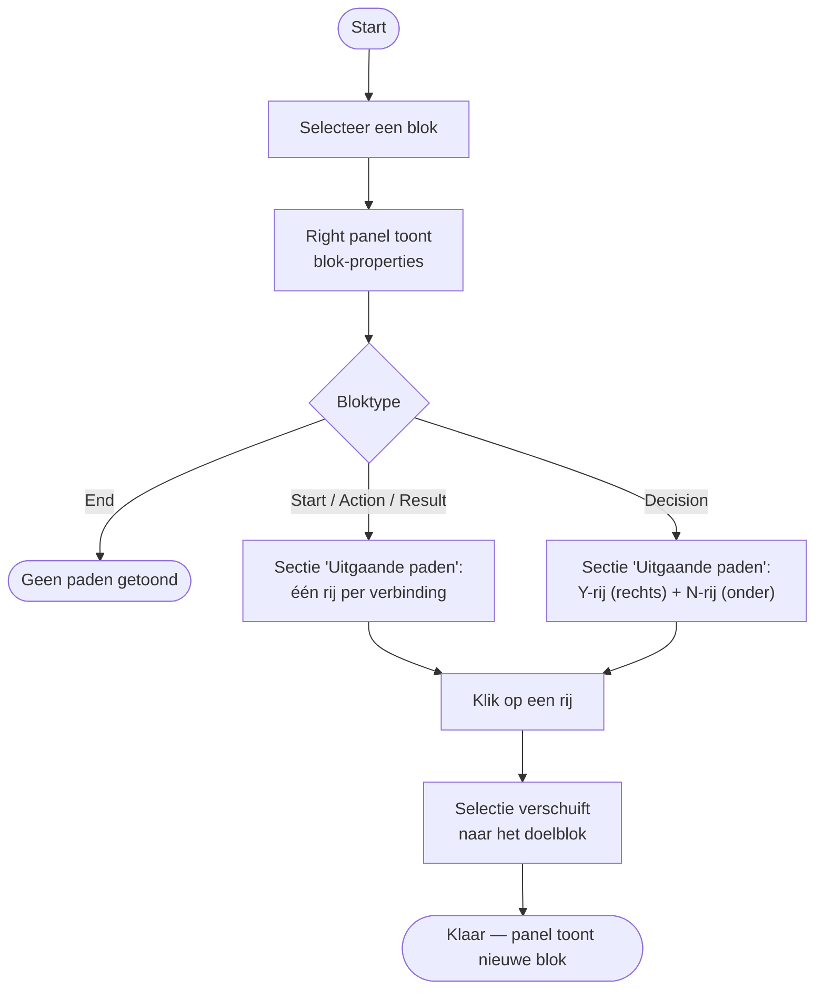

---

## 5. Verbinding handmatig aanmaken

Alle bloktypen behalve Start hebben verbindingspunten op N, O, Z en W. Elk punt is bidirectioneel — het kan als bron én als doel dienen. Bij Decision geldt: **onder = N**, **rechts of links = Y** (rechts is default).

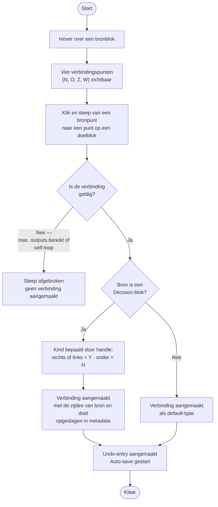

---

## 5b. Bestaande verbinding herverbinden

Een verbinding kan aan beide uiteinden opnieuw worden aangesloten zonder opnieuw te hoeven aanmaken. Label en Data Field blijven behouden; bij een Decision-bron wordt het kind opnieuw bepaald uit de nieuwe bronzijde.

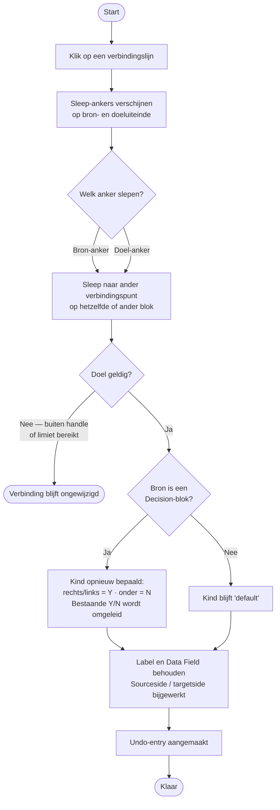

---

## 6. Diagram opslaan

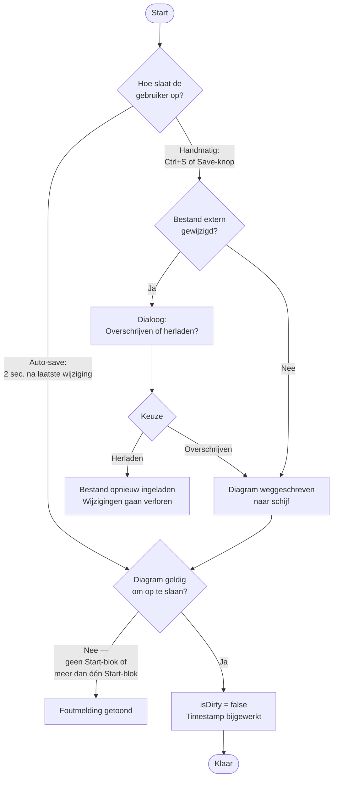

---

## 7. Map openen en bestand selecteren

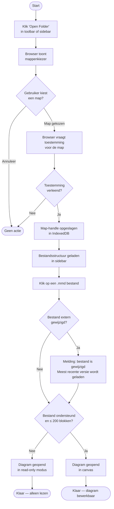

---

## 7b. Bestand of map verslepen in sidebar

Bestanden en mappen kunnen direct naar een andere locatie in de tree gesleept worden. De verplaatsing gebeurt onder water via copy-in-doelmap + delete-uit-bronmap zodat dit ook werkt voor hele mapboomen.

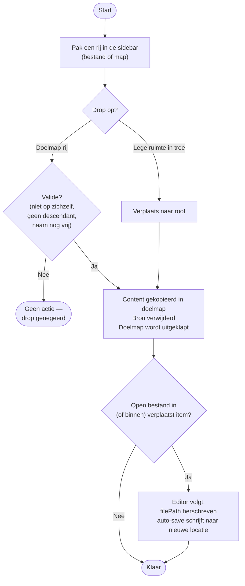

---

## 8. Verbinding verwijderen

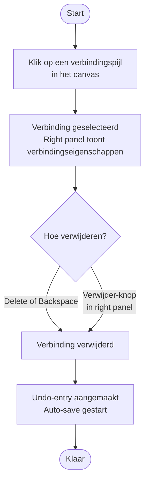

---

## 9. Commentaar toevoegen aan een blok

De Comments-sectie is een vast onderdeel van het blok-properties-paneel en zit onder ID / Label / Uitgaande paden. Het paneel is verdeeld in twee zones met elk hun eigen scroll: bovenin de eigenschappen, onderin de Comments-lijst met een vaste composer. Blokken met ≥ 1 comment tonen een accent-badge met het aantal in de rechterbovenhoek van het blok — zo is in één oogopslag te zien welke blokken notities bevatten.

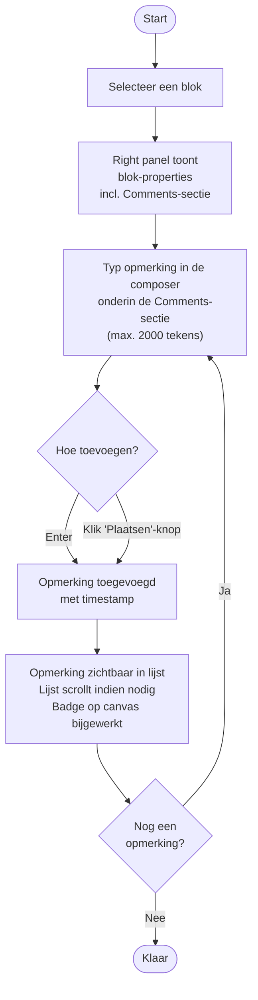

---

## 10. Undo / Redo

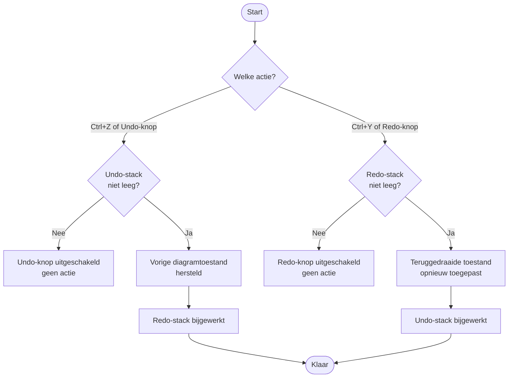

---

## 11. Blok-label bewerken (inline)

Alleen **Action**, **Decision** en **Result** hebben een bewerkbaar label. De labels van **Start** ("Start") en **End** ("End") zijn vast. Speciale tekens (`"`, `<`, `>`, `&`) zijn vrij te typen — ze worden bij het opslaan transparant naar mermaid-entities geëscapet en bij het laden weer terug-gedecodeerd. Zie FO.md §4 "Label-escaping".

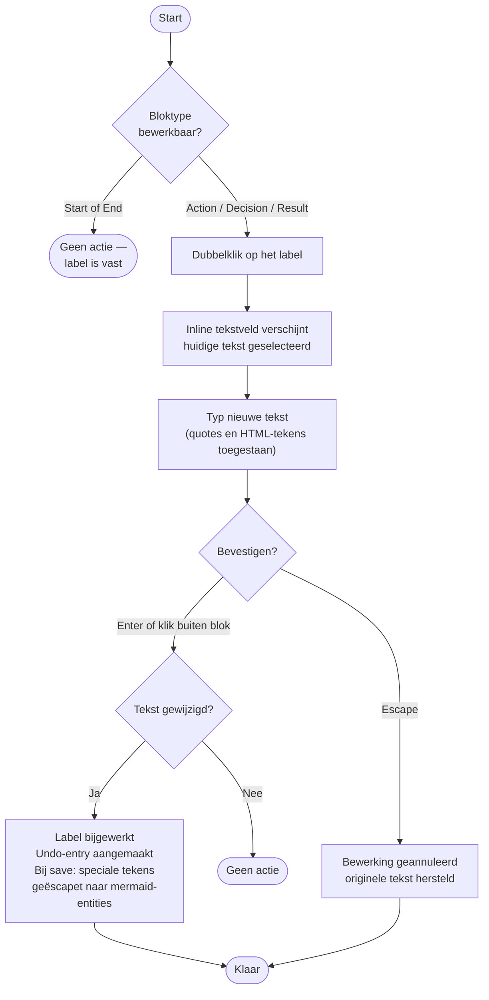

---

## 12. Thema wisselen

De themaknop toont het huidige voorkeur-icoon (**zon** = light, **maan** = dark, **monitor** = system) en cyclet bij elke klik door de drie varianten: light → dark → system → light. De voorkeur wordt in localStorage bewaard; in system-modus volgt de editor live de OS-instelling.

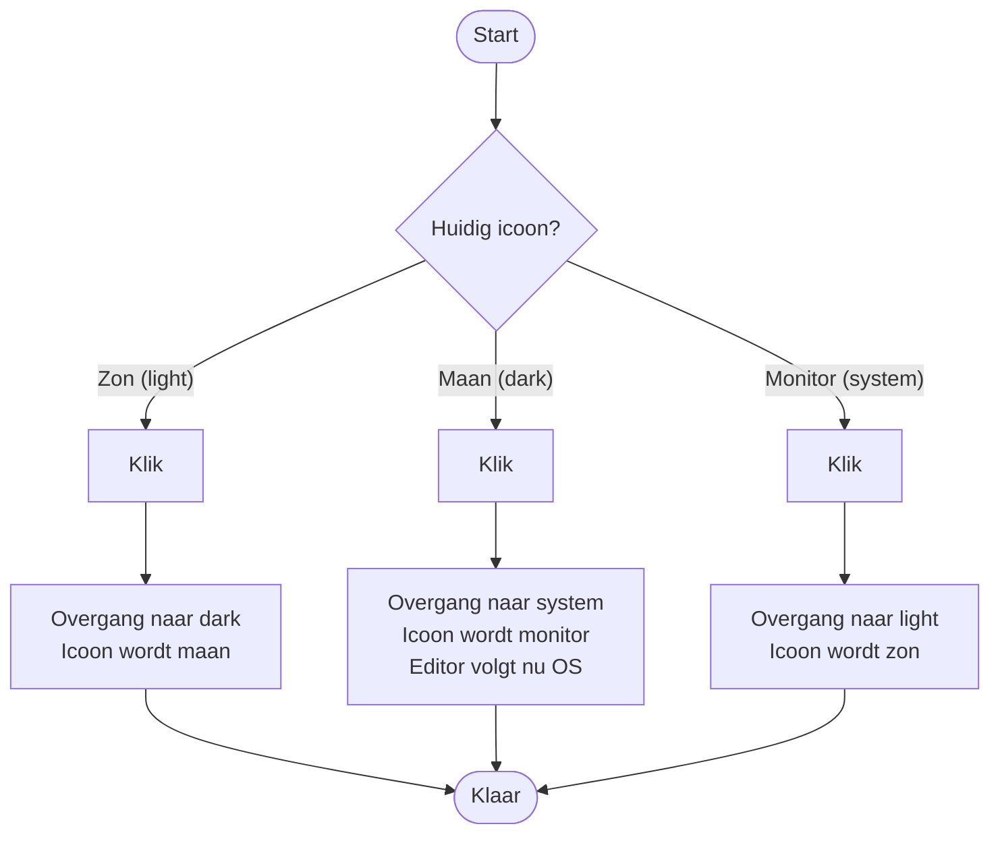

---

## 13. Exporteren als PNG of SVG

De export toont exact wat op het canvas staat: shapes houden hun vulkleur (diamonds krijgen dus een wit of donker interieur afhankelijk van thema), edge-lijnen blijven volledig zichtbaar inclusief label en pijlpunten. Onder water worden alle SVG `fill`/`stroke`-waarden net vóór de snapshot als inline-stijl gezet zodat CSS-variabelen correct meegenomen worden tijdens de clone.

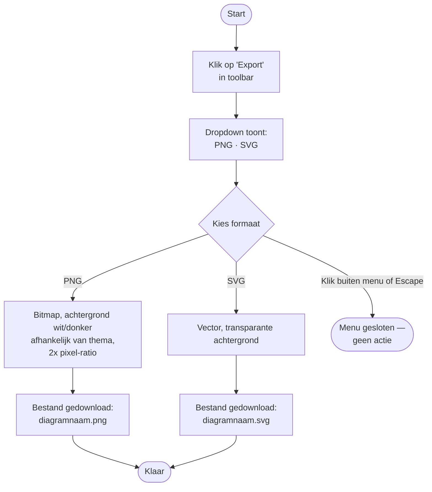

---

## 14. Bestandscontextmenu (rechtermuisknop in sidebar)

Verplaatsen gebeurt niet via het menu maar via drag-and-drop (zie flow 7b).

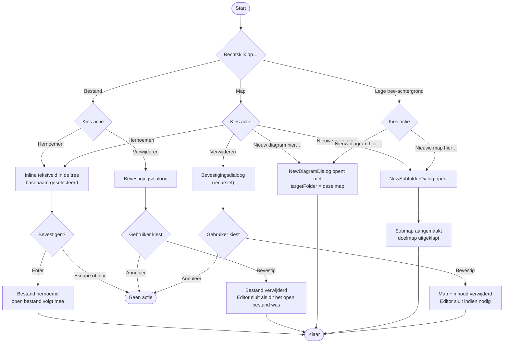

---

## 15. Externe-wijziging-detectie

De editor vergelijkt de `lastModified` van het open bestand met wat lokaal als laatst-opgeslagen bekend is. Checks gebeuren op twee momenten: vlak vóór een write en bij tab-refocus / visibility-change.

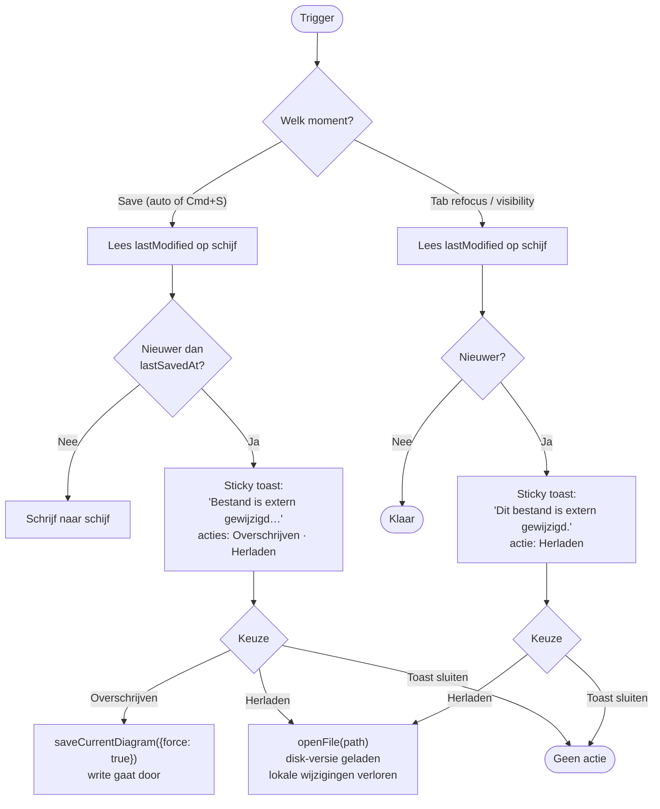

